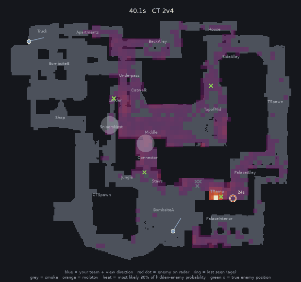

# cspredict: where are they now?

**Probability maps of where the enemies you can't see are, for Counter-Strike 2 demo review.**
Trained on pro and top-level FACEIT matches on Mirage. It uses only what one team knew during the
round, and its percentages are honest: when it says 60–70%, the enemy is there 66% of the time.



*A held-out pro round (EAC vs lilmix, round 9, CT view), from 40 s to the end: a 1v4 with the bomb on
A. The heat shows where the hidden Ts probably are (the most likely 80% of the probability). Rings
mark where each was last seen and how long ago; grey discs are smokes, orange discs burning molotovs.
Green ×: where they really were, drawn only for review.*

## What it does

For every enemy who has dropped off one team's radar, cspredict keeps a probability map of where that
enemy is now. It is built only from what that team knew:
- radar sightings, and where teammates stood and looked: a teammate who sees nobody is evidence too
- smokes, flashes and burning molotovs
- the kill feed and the bomb
- the round history and the guns it has seen, to judge what the enemies could afford
- how whole teams tend to be spread out, learned from recorded rounds

`review` renders any round as an animation or contact sheet. `evaluate` scores the maps against where
the enemies really were.

## Results at a glance

On 16 held-out pro maps (102,486 moments where an enemy seen earlier in the round is off the radar):

| | Right callout (of 23) | Right one in the top 3 | Log-loss (lower is better) |
|---|---|---|---|
| **cspredict** | **48.2%** | **72.9%** | **1.66** |
| "They're where I last saw them" | 42.2% | 58.4% | 7.20 |
| "Where that side usually is at this point" | 21.3% | 45.1% | 2.61 |

- In 1v1 clutches it names the right callout 60% of the time; "last seen" manages 43%.
- Its percentages mean what they say. When it says 20–30%, the enemy is there 24% of the time; at
  60–70%, 66%; at 90%+, 97%.
- Log-loss is the average surprise at the truth, −ln(probability given to where the enemy really
  was). It rewards honest uncertainty; a uniform guess over the 23 callouts scores 3.14.

The full tables, with 95% uncertainty ranges and every ablation, are in [docs/results.md](docs/results.md).

## What I found

- **Learned movement and silence matter most.** Replaying real recorded trajectories from similar
  situations beats a random walk by a wide margin (callout log-loss 1.87 vs 3.02). Treating "a
  teammate is looking there and sees nobody" as evidence adds 1.5 to 2.5 points of accuracy to each
  motion model.
- **Honest percentages need to know the time.** Right after a sighting the raw model is too unsure;
  20 s later it is too sure. One correction per horizon fixed both (calibration error 0.0040 →
  0.0010). A single global correction could not.
- **Teams move together, but that only helps once someone has been seen.** Correcting each enemy's
  map with recorded whole-team formations names the right callout for not-yet-seen enemies 1.7
  points more often. Before first contact the same correction hurts, so it waits.
- **Some intuitive features don't pay.** AWPers do move less after being seen (median 190 vs 300
  units in 5 s), but matching on the weapon in hand never beat run-to-run noise. Molotovs help only
  while they burn. Both are measured, reported and left switchable.
- **More data beats purer data.** Pooling 35 FACEIT matches with the 47 pro maps beats the pro maps
  alone (top-1 +1.2 points).
- **A general-purpose AI can be coached, up to a point.** Given the same information, TypeSafe's Jev
  mostly repeats the last sighting. Facts computed in code plus movement rates from the training
  rounds lifted its top-3 from 61% to 70%, but its first guess stayed at "last seen" level, and a
  9-number formula on the same facts beat it. OpenAI's GPT-6 Luna, asked the same questions, did no
  better: level with pushed Jev, still behind the formula, at 5 times the price and 50 times the wait.
  See [docs/jev.md](docs/jev.md).

## How it works

A Bayes filter per enemy, updated every 0.25 s:

1. **Rebuild what the team knew** from the demo: radar, teammates' positions and view directions,
   smokes, flashes, molotovs, kill feed, bomb.
2. **Learn the map from where players stand** (no nav mesh needed): about 2,000 cells of 64 units,
   and a spotting model fitted on 27 million observer–enemy pairs that says how likely each teammate
   was to see someone in each cell.
3. **Predict movement two ways:** particles that replay recorded trajectories from similar
   situations, and a grid Markov model. Both depend on how long ago the enemy was seen, and both keep
   out of burning molotovs.
4. **Update on the evidence:** sightings, "not on the radar" (negative information) and the kill feed.
5. **Correct for teamwork and calibrate:** recorded whole-team snapshots reshape each enemy's callout
   probabilities, and a calibration fitted on validation rounds makes the percentages honest.

Module-by-module details are in [docs/results.md](docs/results.md#how-it-works-step-by-step), and
related work is in [prior_art.md](prior_art.md). The closest is Hladky & Bulitko (2008), which did
this for CS:Source with 190 LAN logs on one map.

## Try it

```bash
python3.12 -m venv .venv                             # Python 3.11–3.13; awpy 2 does not install on 3.14
.venv/bin/pip install -e ".[dev]"
.venv/bin/python -m cspredict.fetch_xego             # FACEIT dev demos -> data/raw/xego/ (~17 GB; --limit 3 to try)
.venv/bin/python -m cspredict.parse                  # demos in data/raw/<source>/ -> data/parsed/
.venv/bin/python -m cspredict.build --sources xego   # fit the map, spotting, motion, fire and team models (~2 min)
.venv/bin/python -m cspredict.evaluate --split val --models ens_uncal --out outputs/eval_val
.venv/bin/python -m cspredict.calibrate --run outputs/eval_val --model ens_uncal   # honest percentages
.venv/bin/python -m cspredict.evaluate --split test  # score all filters on held-out matches
.venv/bin/python -m cspredict.review --list <demo_id>
.venv/bin/python -m cspredict.review <demo_id> <round> --side ct --truth
.venv/bin/python -m pytest
```

`review` writes `outputs/review/<demo>_r<round>_<side>_<model>.gif` and `.png`. Without the
`calibrate` step `ens` still runs, uncalibrated, with a warning. To use pro demos, see
[docs/data.md](docs/data.md); HLTV demos have to be downloaded by hand.

## Documentation

- [docs/results.md](docs/results.md): all results, uncertainty ranges, each enhancement's effect,
  what mattered, and how it works step by step
- [docs/data.md](docs/data.md): the data used, and how to add HLTV pro demos
- [docs/jev.md](docs/jev.md): benchmark against TypeSafe's Jev, a general-purpose AI model, and
  against OpenAI's GPT-6 Luna on the same questions
  ([protocol, written before the run](docs/frontier_protocol.md))
- [prior_art.md](prior_art.md): related work

## Limitations

- **One map, little pro data.** Everything is learned per map (only Mirage so far), from 71 pro and
  46 FACEIT maps. Teams recur across the train/test split.
- **Sound** (footsteps, gunfire) is not used, by choice. It is probably the largest source of
  information left out.
- **Identity:** enemies are assumed identifiable when they appear on the radar.
- **Coordination** is a correction on top of independent per-enemy filters, and the model still
  underestimates how many enemies stack in one callout.
- **Geometry is learned** from where players stand, so windows and rarely walked areas are
  approximate.

## License

MIT; see [LICENSE](LICENSE).
