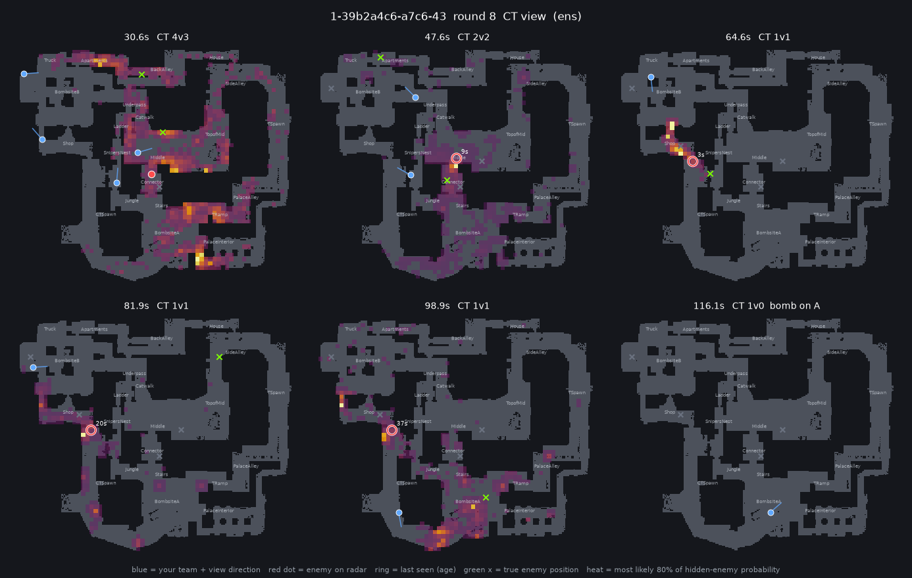

# cspredict: where are they now?

Probabilistic enemy-position estimates for **Counter-Strike 2 demo review**, starting with Mirage.

For every enemy who has dropped off one team's radar, it keeps a probability map of where that enemy
is now. The map is built only from what that team knew during the round:
- radar sightings
- where teammates stood and were looking
- smokes and flashes
- the kill feed
- the bomb site

`review` renders a round as a GIF or contact sheet. `evaluate` scores the maps against where the
enemies really were.



*A held-out 1v1, CT view. Blue: CTs and where they look. Ring: an enemy's last sighting and its
age. Heat: the most likely 80% of hidden-enemy probability. Green ×: the true positions, drawn only
for review.*

See [prior_art.md](prior_art.md) for related work. The closest is Hladky & Bulitko (2008), which did
this for CS:Source with 190 LAN logs on one map.

## Quick start

```bash
python3.12 -m venv .venv                             # Python 3.11–3.13; awpy 2 does not install on 3.14
.venv/bin/pip install -e ".[dev]"
.venv/bin/python -m cspredict.fetch_xego             # dev demos -> data/raw/xego/ (~17 GB; --limit 3 to try)
.venv/bin/python -m cspredict.parse                  # demos in data/raw/<source>/ -> data/parsed/
.venv/bin/python -m cspredict.build --sources xego   # fit grid, spotting and motion models (~1 min)
.venv/bin/python -m cspredict.evaluate --split test  # score all filters on held-out matches
.venv/bin/python -m cspredict.review --list <demo_id>
.venv/bin/python -m cspredict.review <demo_id> <round> --side ct --truth
.venv/bin/python -m pytest
```

`review` writes `outputs/review/<demo>_r<round>_<side>_<model>.gif` and `.png`. Use `--truth` to
overlay the real enemy positions, and `--model` to pick another filter (default `ens`). To use the
pro-trained models, add `--train-sources hltv xego` at the end of the command, after the demo id and
round, because the option takes several values.

## Adding HLTV pro demos

HLTV sits behind a Cloudflare challenge, so download demos in your browser:

1. On hltv.org, go to **Results** and filter the map to Mirage (add event or star filters if you like).
2. Open a match and click **GOTV Demo**. You get one `.rar` per series.
3. Put the `.rar` files in `data/raw/hltv/`.
4. Run `python -m cspredict.parse`. HLTV names each demo in a series `…-m<k>-<map>.dem`, so only the
   Mirage demos are unpacked (with `bsdtar`) and the series' other maps stay in the archive. The map is
   then confirmed from each demo's header.
5. Train and score:
   - `python -m cspredict.build --sources hltv`, or `--sources hltv xego` to pool with the FACEIT data
   - `python -m cspredict.evaluate --train-sources hltv --split test`

Each demo gets a stable random split (70/10/20 train/val/test). To hold out, say, the newest events,
add `data/raw/hltv/splits.csv` with columns `demo_id,split`.

## Data used so far

**HLTV (pro):** 71 Mirage maps, one from each of 71 series downloaded from HLTV in September 2026.
Events include CCT, ESEA, ESL Challenger League, iBuyPower Masters and Stake Pulse, so most teams are
tier 2–3, with some tier 1. The stable hash split gives 47 / 8 / 16 train / val / test maps. The CS2
patch is newer than the FACEIT set (14181–14185 vs 14094), but the Mirage layout matches: 99.9% of pro
positions fall on cells the FACEIT data had already mapped.

**FACEIT (development):** the 46 Mirage matches of **X-Ego-CS**
([paper](https://arxiv.org/abs/2510.19150), [data](https://huggingface.co/datasets/wangyz1999/X-EGO-CS), MIT).
- These are FACEIT matches between top-100 FACEIT players, not pro teams, so strategies are less
  coordinated than in HLTV demos.
- They ship with 35 / 5 / 6 train / val / test matches.
- `python -m cspredict.fetch_xego` downloads them with the split file. The raw demos are 17 GB;
  the parsed tables in `data/parsed/` are 82 MB.

## How it works

| Step | Module | What it does |
|---|---|---|
| What the team knew | `infostate.py` | Rebuilds the radar from the demo's per-player `spotted_by` lists. Every 0.25 s it records teammates' positions and view angles, which enemies are on the radar, active smokes, flashed teammates, kill-feed entries and the bomb site. True enemy positions are kept for scoring only. |
| Map grid | `grid.py` | awpy's map downloads were returning 403, so the walkable area is learned from where players stand: 1,949 cells of 64 units, two floors where levels overlap (underpass/catwalk), and Mirage's 23 callouts. |
| Spotting model | `visibility.py` | P(an enemy standing here would show up on our radar), given where each teammate stands and looks. Built from ray casts through the walked area plus "carved" see-through space (every real spotting proves its sight line was clear), then a logistic model calibrated on 8.8M observer–enemy pairs. Held-out AUC 0.99. This supplies the negative evidence: my teammate is looking at A ramp and sees nobody, so the enemy is probably not on ramp. |
| Grid motion | `motion.py` | Markov model over cells. Transitions depend on side, bomb phase (not planted / A / B) and time since the enemy was last spotted, because a player who was just seen usually holds or falls back instead of running on. |
| Particle motion | `particles.py` | Each hypothesis follows a real recorded trajectory from a similar situation: same side, nearby cell, heading, round time, bomb phase, time since spotted, and (softly) the team's buy. This captures fast rotations that the grid model smears out. |
| Filters | `filters.py` | Bayes filter per enemy: predict with a motion model; update on radar sightings, on "not on the radar", and on the kill feed (the killer must have had a sight line to the victim). `ens` = 75% particles + 15% grid + 10% "usual positions at this round time". |

## Results

A sample is an enemy who was seen earlier in the round and is off the radar now, which is the
mid/late-round case. "Callout top-1" is how often the most likely of Mirage's 23 callouts is where the
enemy really is. Higher is better except for log-loss. A uniform guess scores 3.14 callout log-loss
and 7.58 cell log-loss.

### Pro matches: 16 held-out HLTV maps, 102,486 samples

The models were trained on 47 HLTV + 35 FACEIT maps (`build --sources hltv xego`).

| Model | Callout top-1 | Callout log-loss | Cell log-loss | True cell in top 20 |
|---|---|---|---|---|
| **ens** (particles + grid + prior, all evidence) | **0.478** | **1.69** | **5.86** | 0.314 |
| pf (particles) | 0.470 | 1.87 | 6.92 | 0.295 |
| hmm (grid motion) | 0.467 | 2.60 | 7.07 | **0.323** |
| diffuse (random walk, no learning) | 0.443 | 3.03 | 7.86 | 0.242 |
| last_seen ("they're where I last saw them") | 0.422 | 7.20 | 16.67 | 0.047 |
| prior (where that side usually is at this time) | 0.213 | 2.61 | 7.26 | 0.091 |

For `ens` the true callout is in the top 3 72.6% of the time (prior: 45.1%). Its percentages are
close to honest. For example, when it says 40–50% the enemy is there 39% of the time; at 70–80%,
74%; at 90%+, 98%.

Callout top-1 by seconds since the enemy was last seen (ens / last_seen / prior):

| 0–2 s | 2–5 s | 5–10 s | 10–20 s | 20–40 s | 40 s+ |
|---|---|---|---|---|---|
| 0.89 / 0.88 / 0.20 | 0.71 / 0.68 / 0.20 | 0.54 / 0.50 / 0.21 | 0.42 / 0.37 / 0.25 | 0.30 / 0.23 / 0.20 | 0.25 / 0.15 / 0.21 |

Clutches with one friendly player left (callout top-1, ens / last_seen / prior):

| 1v1 | 1v2 | 1v3 | 1v4 | 1v5 |
|---|---|---|---|---|
| 0.59 / 0.43 / 0.36 | 0.53 / 0.42 / 0.35 | 0.50 / 0.38 / 0.31 | 0.38 / 0.34 / 0.16 | 0.39 / 0.39 / 0.13 |

Which training data works best on the same 16 pro test maps (`ens`):

| Trained on | Callout top-1 | Callout log-loss | Cell log-loss |
|---|---|---|---|
| FACEIT only (35 maps) | 0.460 | 1.77 | 6.18 |
| HLTV only (47 maps) | 0.466 | 1.73 | 5.95 |
| **Both (82 maps)** | **0.478** | **1.69** | **5.86** |

### FACEIT development set: 6 held-out matches, 48,876 samples (FACEIT-only models)

| Model | Callout top-1 | Callout log-loss | Cell log-loss |
|---|---|---|---|
| **ens** | **0.461** | **1.78** | **6.10** |
| last_seen | 0.378 | 7.83 | 16.77 |
| prior | 0.219 | 2.60 | 7.59 |

Pro play is more predictable than FACEIT pugs. "Last seen" alone does better on pro matches (42% vs
38%), because pros hold positions more, and the model's lead is largest in pro clutches (1v1: 59%
vs 25% on FACEIT).

What mattered, from validation ablations:
- **Negative information** improves every motion model.
- **Conditioning on time since last spotted** was the largest single fix: it roughly halved the cases
  where the truth got near-zero probability.
- **Correct A/B bomb site** helps after the plant.
- **Kill feed:** a small gain. It matters because 48% of killers are not on the radar at the moment
  of the kill.
- **Features you proposed:**
  - Buy type helps a little, but only when matched softly.
  - Man-advantage (1vX) and same-player matching did not help on the FACEIT data. Even soft
    versions left too few matching trajectories. Both are implemented but off and haven't been
    re-tested on the HLTV data yet.
- **Scoring rule:** "probability within 300 units of the truth" favours the point guess
  `last_seen`. It is not a proper scoring rule, so the headline numbers use log-loss and callout
  accuracy.

## Benchmark: a general-purpose AI model (TypeSafe Jev)

`typesafe_bench.py` asks [TypeSafe](https://docs.typesafe.ai/introduction)'s Jev (a hosted model that
answers multiple-choice questions with probabilities) the same question our filters answer. It uses
3,000 random held-out pro moments.
- `describe.py` writes each moment as JSON, using only what the team knew and naming places by callout.
- For each hidden enemy, Jev is asked which of the 23 callouts they're in.
- Its probabilities are scored exactly like ours. The 95% intervals resample whole rounds.

| Model | Callout top-1 | Top 3 | Callout log-loss |
|---|---|---|---|
| **ens** (ours) | **0.484** (0.456–0.515) | **0.735** | **1.67** |
| Jev + walking/running times to each callout (`--variant reach_walk`) | 0.406 (0.375–0.438) | 0.621 | 2.64 |
| Jev + running times (`--variant reach`) | 0.401 | 0.624 | 2.92 |
| Jev, plain description (`--variant base`) | 0.408 | 0.612 | 3.99 |
| last_seen | 0.420 | 0.584 | 7.15 |
| prior | 0.233 | 0.466 | 2.59 |

- **Jev mostly repeats the last sighting.** Its top pick is the last-seen callout 73–84% of the time.
- **It trails `ens` at every horizon.** For example, 47% vs 38% at 10–20 s after the last sighting.
- **It adds nothing to `ens`.** The best blend weight, tuned on half the rounds and checked on the
  other half, is 0.
- **Travel times computed in code** (TypeSafe's own advice) fixed most of its overconfidence, but not
  its accuracy.
- **Walking times matter.** In pro clutches the last player alive shift-walks for 68% of their
  movement (median moving speed 117 units/s, vs 250 running), so running times alone overstate how
  far a player gets.

To run it: `pip install -e ".[bench]"`, put `TYPESAFE_API_KEY` in the environment or in a
git-ignored `.env`, then `python -m cspredict.typesafe_bench --n 3000 --variant reach_walk`. It costs
about $0.25 per 3,000 moments, and answers are cached in `outputs/typesafe/`.

## Known limitations and next steps

- **More pro data.** 71 pro maps is still small, and teams recur across the train/test split.
  Team-specific tendencies and the switched-off 1vX and player matching are worth re-testing as the
  set grows.
- **Sound.** Footsteps and gunshots aren't used yet. Gunfire in particular is heard map-wide in
  late-round fights and is probably the biggest remaining gain. Footsteps are already parsed.
- **Identity.** Enemies are assumed identifiable when they appear on the radar.
- **Coordination.** Each enemy is tracked independently, so trades, stacks and "one is lurking"
  logic are not modelled.
- **Geometry is learned.** Windows, low boxes and rarely walked areas are approximate. If awpy's
  `.tri` files become downloadable again (`awpy get tris`), exact line-of-sight could replace the
  ray-cast prior.
- **One map.** Everything is learned per map, so other maps need their own demos.
