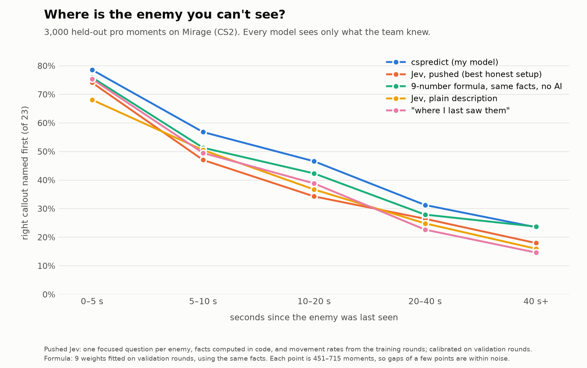

# Benchmark: a general-purpose AI model (TypeSafe Jev)

[TypeSafe](https://docs.typesafe.ai/introduction)'s Jev (`jev-1.13.0`) is a "System One" model: it answers
typed multiple-choice questions with a probability for every option, quickly and cheaply ($0.042 per
million input tokens). This page asks how far it can be pushed on the question cspredict answers,
"which of Mirage's 23 callouts is this hidden enemy in?", without cheating.

## How far can Jev be pushed, honestly?



**Rules.** Jev only sees what the friendly team knew at that moment, built by `describe.py`. It never
sees later events, true positions, or cspredict's beliefs. Facts computed for it in code are named as
such: travel times, how likely the team was to spot someone in each callout, and how often players of
that side are in each callout at this point of a round. Base rates come from the *training* demos
only. Every variant was compared on 2,000 validation moments (8 maps). Then all of them, not just the
winner, were run once on 3,000 test moments (16 maps). Calibration, the formula and the blend weights
were fitted on validation. The code is `src/cspredict/jev_lab.py`.

**Variants**, in the order they were tried:

| Variant | What Jev gets |
|---|---|
| plain | the moment described as JSON: time, bomb, teammates and where they look, callouts being watched, each enemy's last sighting, the kill feed, smokes and molotovs |
| + travel times | plus walking and running times from the last sighting to each callout |
| focused | TypeSafe's own advice: one question per enemy with only that enemy's context, and each of the 23 options carrying facts computed in code (reachable since last seen? can the team see it now? watched since? usual for that side now?) |
| split | the focused variant asked as two atomic questions, combined in code: "still where last seen?" (yes/no), then "if not, which callout?" |
| split + movement rates | plus a lookup table from the training rounds: of the players last seen in that callout that long ago, the share still there, and where the ones who left are now |

**Results on the 3,000 test moments** (95% intervals resample whole rounds):

| | Callout top-1 | Top 3 | Log-loss (lower is better) | Picks the last-seen callout |
|---|---|---|---|---|
| **cspredict** (our model) | **0.489** (0.459–0.522) | **0.739** | **1.648** | 59% |
| Formula: 9 weights on the facts + movement rates, no Jev | 0.457 (0.425–0.490) | 0.710 | 1.819 | 75% |
| Jev, split + movement rates, calibrated | 0.416 (0.387–0.449) | 0.703 | 1.944 | 40% |
| Jev, split, calibrated | 0.416 | 0.683 | 2.023 | 75% |
| Jev, focused, calibrated | 0.419 | 0.642 | 2.038 | 86% |
| Jev, + travel times, calibrated | 0.404 | 0.629 | 2.182 | 76% |
| Jev, plain, calibrated | 0.406 (0.375–0.443) | 0.605 | 2.180 | 84% |
| Jev, plain, raw | 0.406 | 0.605 | 4.066 | 84% |
| "Where I last saw them" | 0.420 (0.388–0.455) | 0.584 | 7.150 | 100% |
| Where that side usually is at this time | 0.233 | 0.466 | 2.589 | 19% |

The enemy really is still in the callout where it was last seen in 42% of these moments.

What the numbers say:
- **Plain Jev mostly repeats the last sighting.** 84% of its top picks are the last-seen callout,
  its top-1 is no better than "last seen", and its raw probabilities are overconfident (log-loss 4.07).
- **Calibration is the cheapest big win.** A two-number correction per time-since-seen group, fitted
  on validation, brings plain Jev's log-loss from 4.07 to 2.18.
- **TypeSafe's playbook helps its probabilities, not its first guess.** Computing facts in code,
  focusing each question and splitting it into atomic questions improved log-loss step by step. But
  per-option facts on their own mostly made Jev more sure of itself: top-3 rose a little (0.605 to
  0.642) while its raw log-loss got worse (4.07 to 4.22).
- **Knowing how players move breaks the anchoring.** With the movement rates, Jev picks the last-seen
  callout 40% of the time, close to the true 42%. Its top-3 rises from 0.605 to 0.703, +9.8 points
  (+7.8 to +11.6) over plain Jev, and log-loss falls by 0.24 (0.19 to 0.28). Its top-1 stays level with
  "last seen" (−0.003, −0.035 to +0.030). After 20 s it beats "last seen", but at 5–20 s, where
  staying put is still a good bet, it moves too eagerly.
- **The same facts in a 9-number formula do better.** Pushed Jev trails the formula by 4.1 top-1
  points (1.1 to 6.9) and 0.13 in log-loss, and ties it on top-3.
- **Jev adds a little on top of the formula.** Blending 20% Jev into the formula improves log-loss by
  0.034 (0.020 to 0.049); top-1 is unchanged. So Jev reads something from the description that the
  nine numbers miss, just not much.
- **Cost:** about $1.05 of API calls for all the validation experiments and $1.56 for the test run
  (15,000 requests, 37 million input tokens).

Reproduce with `pip install -e ".[bench]"`, `TYPESAFE_API_KEY` in the environment or `.env`, then:

```bash
python -m cspredict.jev_lab --split val --variants base reach_walk focus split split_rates
python -m cspredict.jev_lab --split test --variants base reach_walk focus split split_rates
```

Answers are cached in `outputs/jev/`, and re-running only sends what is missing.

## Jev against OpenAI's GPT-6 Luna, asked the same questions

Is this a Jev problem, or does any AI that reads the moment as text hit the same wall? GPT-6 Luna is
the cheapest GPT-6 model, so it is Jev's rival on price. It was asked exactly the questions Jev got:
the same 2,000 validation and 3,000 test moments, with the requests built by the same code. The
rules were written down before any GPT answer was collected; see
[frontier_protocol.md](frontier_protocol.md). In short:
- GPT saw each question in TypeSafe's format, with TypeSafe's own definitions of its question types,
  and gave a probability for every option.
- It ran at OpenAI's default reasoning setting ("medium"), with no tools and no web search.
- Both models got the same calibration and the same blend with the formula, fitted on validation.
- Ties get split credit for every model. The Jev lab counted them as misses, which cost Jev's plain
  top-3 2.5 points (0.605 above, 0.630 here).
- Two setups were chosen in advance, plain and split + movement rates, and the test moments were run
  once.

**Results on the 3,000 test moments** (calibrated; 95% intervals resample whole rounds):

| | Callout top-1 | Top 3 | Log-loss | Picks the last-seen callout | Cost per 1,000 questions | Seconds per answer |
|---|---|---|---|---|---|---|
| **cspredict** (our model) | **0.489** (0.459–0.522) | **0.739** | **1.648** | 59% | | |
| Formula: 9 weights on the facts + movement rates | 0.457 (0.425–0.490) | 0.710 | 1.819 | 75% | | |
| GPT-6 Luna, split + movement rates | 0.432 (0.405–0.462) | 0.685 | 1.959 | 54% | $0.76 | 8.5 |
| Jev, split + movement rates | 0.417 (0.387–0.449) | 0.708 | 1.944 | 40% | $0.14 | 0.16 |
| Jev, plain | 0.407 (0.376–0.444) | 0.630 | 2.180 | 84% | $0.06 | 0.16 |
| GPT-6 Luna, plain | 0.373 (0.346–0.400) | 0.626 | 2.141 | 54% | $0.48 | 6.5 |
| "Where I last saw them" | 0.420 (0.388–0.455) | 0.586 | 7.150 | 100% | | |

Seconds are medians: GPT's from the test run, Jev's from the 200 pilot requests. Costs use the list
prices on 2026-09-28.

What the numbers say:
- **With Jev's best questions, the two are level.** Luna's first guess is 1.6 points better (−0.4
  to +3.5). Jev's top 3 is 2.3 points better (0.7 to 3.9), and their log-loss differs by 0.015
  (−0.039 to +0.070). Jev gets there about 50 times faster and at a fifth of the price. TypeSafe's own
  evals also put the two about level; here that holds on real outcomes.
- **From the plain description, Jev's first guess is better.** Luna names the right callout 3.4
  points less often than Jev (1.2 to 5.7), and 4.7 points less often than "last seen" (2.0 to 7.4).
  It leaves the last-seen callout too soon: in the 5 s after a sighting it is right 62% of the time,
  against Jev's 68% and "last seen"'s 75%. Its percentages are a little more honest, but within noise
  (log-loss −0.039, −0.087 to +0.009).
- **Luna's reasoning helps only long after a sighting.** With the split questions, 40 s or more after
  a sighting, Luna is right 22% of the time, against Jev's 18% and "last seen"'s 15%.
- **Neither AI beats the formula.** Given the same facts, the 9-number formula also beats Luna, by
  2.5 top-1 points (0.4 to 4.4) and 0.14 in log-loss. So the gap is not a Jev problem: at this price,
  an AI reading the description does no better than a formula on the facts computed for it.
- **Luna adds a little on top of the formula.**
  - Blending 25% of its split answers into the formula improves log-loss by 0.017 (0.006 to 0.028).
    For comparison, Jev's blend above improves it by 0.034.
  - With the plain answers and the formula without movement rates, the blend improves log-loss by
    0.064 (0.042 to 0.087) and top-1 by 1.1 points (0.2 to 2.0).
- **Cost and speed:** all of Luna's runs (pilot, validation and test, 9,943 requests) cost $6.20,
  with no failed answers.
  - It thought for about 530 tokens per plain answer and 760 per split answer.
  - It answered in a median 6.5–8.5 s, against 0.16 s for Jev.

Reproduce with `pip install -e ".[bench]"` and `OPENAI_API_KEY` in the environment or `.env`. The
Jev timing in the pilot also needs `TYPESAFE_API_KEY`. Then:

```bash
python -m cspredict.frontier_bench --pilot 100 --budget 2
python -m cspredict.frontier_bench --split val --budget 4
python -m cspredict.frontier_bench --split test --budget 6
```

Answers are cached in `outputs/frontier/`, and re-running only sends what is missing.

## First benchmark (the model before fires, team coordination and calibration)

`typesafe_bench.py` asks [TypeSafe](https://docs.typesafe.ai/introduction)'s Jev (a hosted model that
answers multiple-choice questions with probabilities) the same question our filters answer. It uses
3,000 random held-out pro moments.
- `describe.py` writes each moment as JSON, using only what the team knew and naming places by callout.
- For each hidden enemy, Jev is asked which of the 23 callouts they're in.
- Its probabilities are scored exactly like ours. The 95% intervals resample whole rounds.

| Model | Callout top-1 | Top 3 | Callout log-loss |
|---|---|---|---|
| **ens** (ours) | **0.484** (0.456–0.515) | **0.735** | **1.67** |
| Jev + walking/running times to each callout (`--variant reach_walk`) | 0.406 (0.375–0.438) | 0.621 | 2.64 |
| Jev + running times (`--variant reach`) | 0.401 | 0.624 | 2.92 |
| Jev, plain description (`--variant base`) | 0.408 | 0.612 | 3.99 |
| last_seen | 0.420 | 0.584 | 7.15 |
| prior | 0.233 | 0.466 | 2.59 |

- **Jev mostly repeats the last sighting.** Its top pick is the last-seen callout 73–84% of the time.
- **It trails `ens` at every horizon.** For example, 47% vs 38% at 10–20 s after the last sighting.
- **It adds nothing to `ens`.** The best blend weight, tuned on half the rounds and checked on the
  other half, is 0.
- **Travel times computed in code** (TypeSafe's own advice) fixed most of its overconfidence, but not
  its accuracy.
- **Walking times matter.** In pro clutches the last player alive shift-walks for 68% of their
  movement (median moving speed 117 units/s, vs 250 running), so running times alone overstate how
  far a player gets.

To run it: `pip install -e ".[bench]"`, put `TYPESAFE_API_KEY` in the environment or in a
git-ignored `.env`, then `python -m cspredict.typesafe_bench --n 3000 --variant reach_walk`. It costs
about $0.25 per 3,000 moments, and answers are cached in `outputs/typesafe/`.
